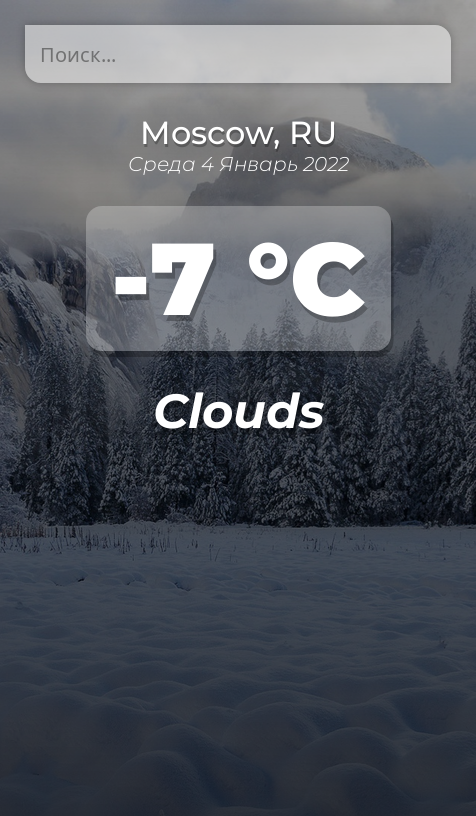
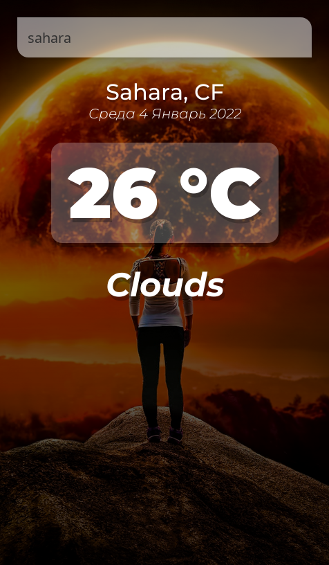

# Vue.js weather app

Данные по прогнозу погоды получены с [OpenWeather](https://openweathermap.org/current)

* * *
Результат работы можно посмотреть тут: <a href="https://vue-weather.noble24.pro/" target="_blank">  </a> и <a href="https://vue-weather-noble24.netlify.app/" target="_blank">  </a>
* * *

[](https://wakatime.com/badge/user/387a55ad-b952-4b4b-a858-04fb88e1e94c/project/226cdd24-0ec8-4887-90ae-3deba23c7a3c)

| Холодно | Жарко |
| ------- |:-----:|
|||


## Project setup
```
npm install
```

### Compiles and hot-reloads for development
```
npm run serve
```

### Compiles and minifies for production
```
npm run build
```

### Lints and fixes files
```
npm run lint
```

### Customize configuration
See [Configuration Reference](https://cli.vuejs.org/config/).
